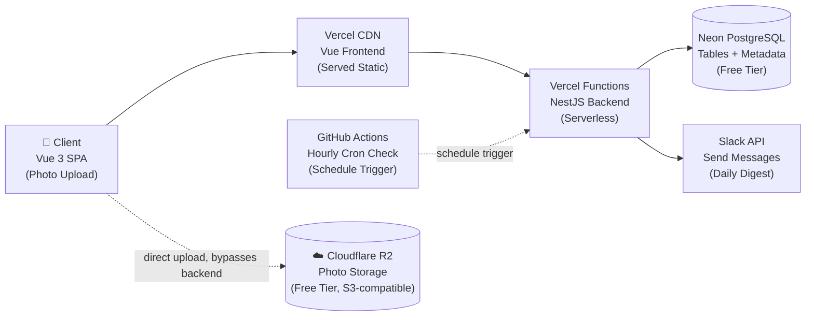
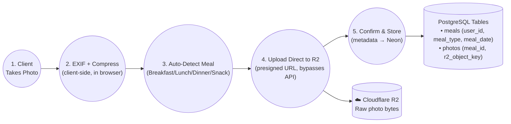
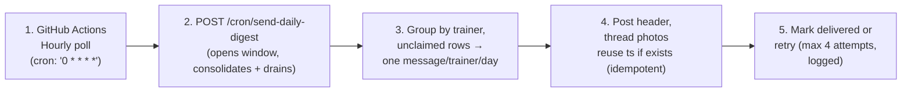

# Meal Tracker — Architecture Diagram

Infrastructure & data flow.

## High-Level Architecture

Not shown as a separate arrow to keep this diagram readable: NestJS also talks to R2 directly — generating the small presigned URLs the client uses for upload (file bytes never pass through NestJS here), and, separately, downloading photo bytes from R2 during the digest job to relay into Slack (ADR-008; see the Digest Delivery Flow below).

**Legend:**

| Color | Component type |
|---|---|
| Light blue | Client/User Device |
| Black | Vercel CDN |
| Sky blue | Vercel Serverless |
| Green | Database |
| Purple | Scheduler |
| Pink | External API |
| Orange | Object Storage (R2) |

## Upload Data Flow

## Digest Delivery Flow (Event-Driven Enqueue + Hourly Drain, Consolidated Daily Message)

Enqueue happens earlier and separately from this diagram: the moment `POST /meals/confirm-upload` confirms a photo landed in R2, it upserts a row into `digest_deliveries` (ADR-012). What's shown below is the hourly job that consolidates queued rows into **one Slack message per trainer per day** (ADR-013) and drains photos into it — same-day and catch-up alike now wait for the same daily window, no more immediate catch-up posting.

**Example — one message, whole trainer DM (ADR-013):**

> Hi Trainer_Name — posted once, at digest_time, whatever else happens after:
>
> Meal photos for today: Breakfast 5 · Lunch 5 · Dinner 5 · Snack 5 (photos threaded below)
>
> Remaining meal photos for Sept 16: Breakfast 3 · Lunch 3 · Dinner 3 · Snack 3 (own section, own date)
>
> ↳ All 32 photos above thread under this ONE header — no separate message per meal, no message before digest_time
>
> *A meal that already had a delivery and gains a new photo later still threads into its own original message, not this one*
> *Tomorrow's window claims anything uploaded after this message posted — never squeezed into today's*

Each row in `digest_deliveries` is still its own unit of work (per meal, per trainer) — no single global "sent" flag. A row is eligible same-day when `meal_date = CURRENT_DATE`, or as catch-up when `meal_date` is within the last 7 days (ADR-011) — both now wait for the same `digest_time` gate (ADR-013). What's new is the layer above it: `digest_messages` holds exactly one row per trainer per day, and every meal claimed into it shares that one `slack_message_ts` instead of each meal getting its own. Delivery is idempotent (`UNIQUE(meal_id, trainer_id)`, thread-reuse via the shared `slack_message_ts`) and retried up to 4 total attempts across successive hourly ticks, with every attempt appended to a durable `attempt_log` for retrospecting on failures (ADR-010).

## Deployment Overview

- **Frontend (Vue 3):** Built with Vite → Deployed to Vercel CDN → Serves static files globally (near-instant loads)
- **Backend (NestJS):** Deployed to Vercel Functions → Scales automatically on demand → No servers to manage
- **Database (Neon):** Managed PostgreSQL → Automatic backups & replication → Free tier covers current usage (5GB) → holds metadata only, no photo bytes
- **Photo Storage (Cloudflare R2):** Client uploads directly via a presigned URL → NestJS never receives the file → Free tier (10GB, zero egress) → separate bucket from anything else in the stack
- **Cron Job (GitHub Actions):** Runs hourly → Calls NestJS endpoint, which checks one global configured send time and sends once when reached → No additional infrastructure needed regardless of how many trainer groups exist
- **Slack Integration:** NestJS posts the digest text via Slack Web API, then downloads each photo from R2 and uploads it natively into Slack (no embedded URL — see ADR-008, which replaced the original presigned-URL approach to avoid its 7-day expiry) → Appears in trainer's DM, threaded under the day's one message → No webhooks required

**✓ All Services in Free Tier:** Vercel free plan handles frontend + backend functions, Neon free tier covers database, Cloudflare R2 free tier covers photo storage (10GB, zero egress). GitHub Actions' hourly digest check (24 runs/day ≈ 720 min/month) stays comfortably within the 2,000 free minutes/month — no need for the repo to be public.

**⚠️ Scaling Limits:** If user base grows to 100+ clients, consider: upgrading to Vercel Pro ($20/mo), Neon paid tier, or migrating backend to Railway ($7/mo for persistent process).

## Scalability by Design

This is the final product rather than a first version, so the structure below is built to absorb growth in clients, trainers, and notification channels without a rewrite — while staying just as simple for the current 2-user scale.

- **Stateless backend:** Every endpoint (upload, digest, admin CRUD) is a plain request/response — no in-memory session state — so Vercel can run as many instances as needed under load with no coordination required.
- **One shared digest schedule:** Every trainer group sends at the same admin-configurable global moment; adding a group never means adding a scheduled job or touching code.
- **Channel-agnostic notifications:** Trainers are reached via a notification_preferences table (channel + identifier), not a Slack-specific field — adding email or WhatsApp later is a data change, not a redesign.
- **Soft delete on accounts:** Removing a client or trainer from the Admin Dashboard deactivates them rather than deleting their history — safe to reorganize the roster as it grows.
- **Storage scales on its own axis:** R2's free tier (10GB) is separate from and larger than Neon's — photo growth never competes with the database's storage budget.
- **Auth can slot in later:** Because client_id and admin actions are already explicit in every request rather than inferred from a session, a login layer — if ever needed — would sit in front of existing endpoints rather than require reshaping them.

## Component Communication Protocols

| From | To | Protocol | Auth |
|---|---|---|---|
| Vue (Browser) | NestJS API | REST + JSON (small payloads only) | None (client_id in request) |
| Vue (Browser) | Cloudflare R2 | HTTPS PUT (direct upload) | Presigned URL (short expiry) |
| NestJS API | Cloudflare R2 | S3-compatible API (presigned URL generation for uploads + GET to download photo bytes, relayed to Slack) | R2 API token |
| NestJS API | Neon PostgreSQL | TCP (pg driver) | Connection string |
| GitHub Actions | NestJS API | HTTPS POST | None (public endpoint) |
| NestJS API | Slack API | HTTPS JSON | Bot token |
| Vue (Admin Dashboard) | NestJS API (/admin/*) | REST + JSON | Shared password |
