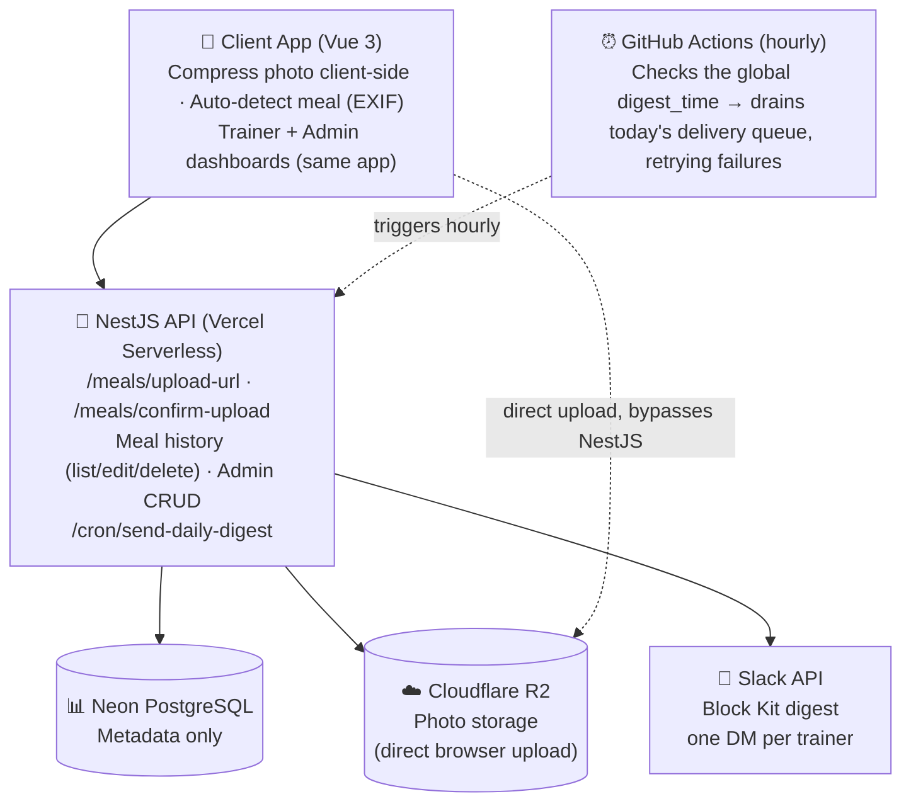

# Meal Tracker — System Design

Photo → Slack Daily Digest for Fitness Coaching. **Cost: $0/month (free tier).**

## Architecture



Dashed = trigger / bypass relationships: GitHub Actions calls NestJS hourly, and the client uploads photo bytes straight to R2 without going through the API at all.

### Tech Stack

- **Frontend:** Vue 3 + Vite on Vercel (free)
- **Backend:** NestJS on Vercel Functions (free)
- **Database:** Neon PostgreSQL (free tier: ~5GB)
- **Cron Job:** GitHub Actions (free)
- **Photo Storage:** Cloudflare R2 — direct browser upload via presigned URLs
- **Messaging:** Slack API (free) — native file upload, not embedded URLs
- **Observability:** Sentry (free) — errors on both frontend and backend, plus cron monitoring on the digest job

### Cost Breakdown

- **Vercel:** $0 (free tier, auto-scales with usage)
- **Neon:** $0 (free tier, 5GB — years of runway now that photos live in R2, not the DB)
- **Cloudflare R2:** $0 (free tier: 10GB storage, 1M writes/month, 10M reads/month, zero egress — recurring monthly, not a trial)
- **GitHub Actions:** $0 — hourly checks (24 runs/day ≈ 720 min/month) stay comfortably within the 2,000 free minutes/month, even on a private repo. No public-repo requirement.
- **Slack API:** $0 (free tier)
- **Sentry:** $0 (free "Developer" tier — 5,000 events/month shared across the frontend and backend projects, 1 cron monitor; permanent, not a trial)
- **Total: $0/month** (until scaling beyond free tiers)

## Data Model

### Core Tables

| Table | Columns |
|---|---|
| **users** | id, name, email, role: client\|trainer, trainer_group_id FK, is_active BOOLEAN default true |
| **trainer_groups** | id, name, digest_timezone VARCHAR |
| **notification_preferences** | id, user_id FK, channel: slack\|email, channel_identifier, is_primary |
| **meals** | id, user_id FK, meal_type: breakfast\|lunch\|dinner\|snack, meal_date, created_at |
| **photos** | id, meal_id FK, r2_object_key VARCHAR, file_size INT, upload_order 1-5, captured_at, uploaded_at |
| **app_settings** | id, digest_time TIME, digest_time_timezone VARCHAR |
| **digest_runs** | id, run_date DATE unique, status, window_opened_at, completed_at |
| **digest_messages** | id, trainer_id FK, run_date DATE, status, slack_channel_id, slack_message_ts, attempt_count, attempt_log JSONB, unique on trainer_id+run_date |
| **digest_deliveries** | id, digest_message_id FK, meal_id FK, meal_date DATE, trainer_id FK, status, photo_progress JSONB, attempt_count, attempt_log JSONB, unique on meal_id+trainer_id |

`digest_runs` and `digest_deliveries` replace the old single `app_settings.last_sent_date` flag with a resumable, idempotent delivery queue — see ADR-010. Every delivery, whether for today's meal or a backdated one within 7 days, is created the moment a photo is confirmed (`POST /meals/confirm-upload`) rather than by a periodic scan — see ADR-012 (which replaced ADR-011's original scan mechanism, keeping its 7-day policy). `meal_date` is denormalized onto the row so "is this today's or a catch-up delivery" is a cheap comparison at drain time, not a stored, driftable label. `digest_messages` is new (ADR-013): one row per trainer per day, holding the single Slack message every one of that trainer's deliveries — same-day or catch-up — gets consolidated into and threaded under, via each delivery's `digest_message_id`.

### Meal Auto-Detect Windows

```
Breakfast:  5:00–10:00
Lunch:     11:00–14:00
Snack:     14:00–16:00
Dinner:    16:00–21:00
Snack:     any other time (incl. 10–11am gap)
```

### Digest Timing — Global Send Moment

```sql
-- ONE global send moment, shared by every trainer group
CREATE TABLE app_settings (
  id UUID PRIMARY KEY,
  digest_time TIME NOT NULL DEFAULT '20:00',
  digest_time_timezone VARCHAR NOT NULL DEFAULT 'UTC',
  updated_at TIMESTAMP DEFAULT NOW()
);

-- PER-GROUP timezone, only used to pick which meals count as "today"
CREATE TABLE trainer_groups (
  id UUID PRIMARY KEY,
  name VARCHAR NOT NULL,
  digest_timezone VARCHAR NOT NULL DEFAULT 'UTC',
  created_at TIMESTAMP DEFAULT NOW()
);

-- Delivery queue (ADR-010) — replaces last_sent_date
CREATE TABLE digest_runs (
  id UUID PRIMARY KEY,
  run_date DATE NOT NULL UNIQUE,
  status VARCHAR NOT NULL DEFAULT 'pending',   -- pending | in_progress | completed
  window_opened_at TIMESTAMP,
  completed_at TIMESTAMP,
  created_at TIMESTAMP DEFAULT NOW()
);

-- One row per trainer per day (ADR-013) — the single message every one of that
-- trainer's deliveries, same-day or catch-up, gets consolidated into and threaded under
CREATE TABLE digest_messages (
  id UUID PRIMARY KEY,
  trainer_id UUID NOT NULL REFERENCES users(id),
  run_date DATE NOT NULL,
  status VARCHAR NOT NULL DEFAULT 'pending',   -- pending | sent | failed_permanent
  slack_channel_id VARCHAR,
  slack_message_ts VARCHAR,
  attempt_count INT NOT NULL DEFAULT 0,        -- retry budget for posting the header itself
  attempt_log JSONB NOT NULL DEFAULT '[]',
  last_attempt_at TIMESTAMP,
  created_at TIMESTAMP DEFAULT NOW(),
  UNIQUE (trainer_id, run_date)
);

CREATE TABLE digest_deliveries (
  id UUID PRIMARY KEY,
  digest_message_id UUID REFERENCES digest_messages(id),  -- which day's single message owns this meal's thread (ADR-013)
  meal_id UUID NOT NULL REFERENCES meals(id),
  meal_date DATE NOT NULL,                     -- denormalized from meals, for cheap eligibility checks (ADR-012)
  trainer_id UUID NOT NULL REFERENCES users(id),
  status VARCHAR NOT NULL DEFAULT 'pending',   -- pending | sent | failed_permanent
  photo_progress JSONB NOT NULL DEFAULT '[]',  -- per-photo upload state
  attempt_count INT NOT NULL DEFAULT 0,        -- resets on reopen (ADR-011); lifetime history lives in attempt_log
  attempt_log JSONB NOT NULL DEFAULT '[]',     -- append-only failure/reopen history, never reset
  last_attempt_at TIMESTAMP,
  created_at TIMESTAMP DEFAULT NOW(),
  UNIQUE (meal_id, trainer_id)
);
```

`app_settings` is a single row, editable via the Admin Dashboard — no code change or redeploy needed to change when the digest goes out. Every trainer group receives their Slack message at that same real-world moment; a group's own `digest_timezone` only decides which meals fall into "today" for them, so content is always correct even though delivery timing is shared. `digest_runs` now only tracks when today's window opened and whether today's own deliveries are all terminal — it no longer owns delivery rows via foreign key. Every delivery, same-day or catch-up, is created the moment its photo is confirmed — see the Daily Digest Job below and ADR-012 — but now waits for `digest_messages` to claim it before anything posts (ADR-013): no more early exemption for catch-up rows.

### Photo Storage — Cloudflare R2

```sql
CREATE TABLE photos (
  id UUID PRIMARY KEY,
  meal_id UUID NOT NULL REFERENCES meals(id),
  r2_object_key VARCHAR NOT NULL,  -- e.g. "photos/{meal_id}/{uuid}.jpg"
  file_size INT NOT NULL,
  upload_order INT CHECK (upload_order BETWEEN 1 AND 5),
  captured_at TIMESTAMP,
  uploaded_at TIMESTAMP,
  created_at TIMESTAMP DEFAULT NOW()
);
```

No raw bytes ever touch Postgres or the NestJS function. Upload flow: client asks NestJS for a presigned R2 PUT URL → uploads the photo bytes directly to R2 → confirms with NestJS, which writes this row. Read flow: dashboards get a fresh presigned GET URL generated per page load; the Slack digest downloads from R2 and uploads natively into Slack (see ADR-008) — no URL embedded, no expiry to worry about.

### Resolved Decisions

- **✓ Photos in R2, not BYTEA:** Direct-to-R2 upload via presigned URLs, bypassing the NestJS function entirely. This supersedes the original BYTEA decision (see ADR-007) — discovered necessary once we found Vercel/Netlify serverless functions cap request bodies at 4.5-6MB, far under the 50MB upload target.
- **✓ Max 5 photos/meal, uploaded independently:** Each photo gets its own presigned URL and its own PUT request — a "5-photo upload" is 5 independent upload cycles, never one batched request, so the 50MB cap applies per photo, not per meal. If 3 of 5 succeed and 2 fail, that's not an error state: the meal just has 3 photos for now, and the other 2 can be added later through the same flow the Client Dashboard already supports.
- **✓ EXIF auto-detect:** Frontend uses piexifjs; server stores both captured_at (EXIF) & uploaded_at (server).
- **✓ No login for client/trainer:** client_id passed directly in requests. Admin endpoints carry basic shared-password protection since they can modify/delete records.
- **✓ Digest time configurable, but global:** One send moment (`app_settings.digest_time`) shared by all trainer groups, editable via Admin Dashboard. Per-group `digest_timezone` still decides which meals are "today" for that group — content stays correct even though delivery timing is shared. (Pre-scheduling different real send times per group was considered and rejected — see ADR-003.)
- **✓ Individual DMs:** Digest job sends one Slack DM per trainer (via their own primary notification_preference), not a shared channel.
- **✓ Image resize, revised:** Now **client-side** (canvas API or a small library), before upload — not server-side Sharp as previously resolved. Once photos upload directly to R2, NestJS never receives the raw bytes to process, so server-side compression is no longer possible in this flow.
- **✓ Delete strategy:** Soft delete (is_active=false) for user accounts, so historical meals/photos stay intact; hard delete for photos (and their R2 objects) once the 1-year retention window passes.
- **✓ Late uploads, revised:** A backdated photo appears in the client/trainer dashboards immediately *and*, if the meal is dated within the last 7 days, is included in the trainer's next daily digest — either a new "remaining meal photos for `<date>`" line (if the meal never had a delivery) or new photos threaded under the meal's existing message (if it did, with no header resent). Older than 7 days stays dashboard-only. This supersedes the original "dashboard only, no Slack" behavior — see ADR-011. Delivery timing itself is revised again by ADR-013: catch-up no longer posts as soon as it's enqueued, it waits for the same daily window as everything else.
- **✓ Orphaned R2 objects:** If a browser upload to R2 succeeds but the confirm call never arrives (crash, closed tab, dropped connection), the object has no database row and is otherwise invisible. Closed via a reconciliation step in the hourly cron — see below and ADR-009.
- **✓ Digest delivery, revised:** No longer a presigned URL embedded in the Slack message — NestJS downloads the photo from R2 and uploads it natively into Slack during the digest job. Removes the 7-day URL expiry limitation entirely; digest history stays viewable indefinitely. See ADR-008.
- **✓ Digest delivery reliability, new:** Sending is now an idempotent, resumable queue (`digest_deliveries`), not a one-shot loop. Each meal×trainer delivery retries up to **4 total attempts (1 initial + 3 retries)** across successive hourly ticks — never re-posting a message or re-uploading a photo that already succeeded — before being marked permanently failed and raised as a distinct Sentry alert. Every attempt, success or failure, is appended to `attempt_log` for retrospective debugging, independent of Sentry's own retention. See ADR-010.
- **✓ 7-day catch-up window, revised:** A meal dated within the last 7 days gets delivered to Slack — a genuinely missed meal gets a fresh delivery, and a meal that already has a `sent` delivery but gained new photos gets those photos threaded under its existing message (no duplicate header, fresh 4-attempt budget just for the new photos). Meals older than 7 days, and meal-type edits/deletions at any age, remain dashboard-only. The policy is unchanged from ADR-011; *how* it's detected changed in ADR-012, and *when* it posts changed again in ADR-013 — see the next two entries.
- **✓ Event-driven enqueue, new:** Rather than an hourly scan inferring what's new, `POST /meals/confirm-upload` enqueues the photo for delivery the instant it's confirmed — same-day and catch-up meals both go through this one path. A daily reconciliation sweep (same cadence as R2 cleanup, ADR-009) catches anything a failed enqueue might have missed. See ADR-012.
- **✓ Single daily digest message, new:** A trainer gets exactly **one** Slack message per day, sent only once `digest_time` passes — not one message per meal, and not one whenever a catch-up photo happens to get confirmed. The message consolidates a "today" section plus one "remaining meal photos for `<date>`" section per distinct catch-up date, each grouped by meal type; every meal's photos then thread underneath that single message. Reopened meals (ADR-011) keep threading into whichever message originally claimed them, even from days ago — never into today's new one. See ADR-013.
- **✓ Observability:** Sentry on both frontend and backend (free tier), plus Sentry Cron Monitoring on the digest endpoint — closes the PRD's "monitored + alerts" requirement that had no implementation until now. Grafana/Prometheus considered and deliberately deferred — a pull-based scraping model doesn't fit serverless functions well, and the questions it answers (latency trends, cross-service correlation) aren't the questions this app has at this scale.

### Upload Concurrency (implementation note)

When a client selects multiple photos for one meal, the frontend should cap how many upload cycles run in parallel (2-3 at once) rather than firing all 5 simultaneously. These are typically phone-camera uploads over mobile connections — saturating the connection with 5 concurrent multi-MB uploads tends to make all of them slower and more failure-prone, not faster. Not an architecture decision, just a stated default so it isn't left to whoever writes the upload code.

### EXIF Read Must Precede Compression (implementation note)

The client-side compress step (Canvas API, ADR-007) must read EXIF from the original file — via `piexifjs`, before `canvas.drawImage()` — never after. Two reasons this order isn't optional: (1) `canvas.toBlob()` re-encodes the image from scratch, stripping all EXIF metadata, so `captured_at` is gone from the compressed output if it isn't read first; (2) `canvas.drawImage()` draws raw pixel data and ignores the EXIF `Orientation` tag — unlike an `` tag, which auto-rotates. Phone cameras don't rotate pixel data for portrait shots, only tag it; if the orientation tag isn't read and applied as a canvas rotation before drawing, portrait photos come out sideways or upside-down in the compressed file, with no EXIF tag left downstream to correct it. Not an architecture decision, just a build-order dependency so it isn't left to whoever writes the compress step.

### Digest Enqueue — inside POST /meals/confirm-upload (ADR-012)

```
// runs synchronously, right after writing the photo row — this is the ONLY place
// a digest_deliveries row is created or gains a photo; no separate generation step exists
if meal.meal_date < today - 7 days: return   -- outside the catch-up window (ADR-011); dashboard-only
for each trainer in meal.client.trainer_group:
  INSERT digest_deliveries (meal_id, meal_date=meal.meal_date, trainer_id,
    status='pending', photo_progress=[{photo_id, status:'pending'}])
  ON CONFLICT (meal_id, trainer_id) DO UPDATE SET
    photo_progress = digest_deliveries.photo_progress || jsonb_build_array({photo_id, status:'pending'}),
    status = 'pending',
    attempt_count = CASE WHEN digest_deliveries.status='sent' THEN 0 ELSE digest_deliveries.attempt_count END,
    attempt_log = digest_deliveries.attempt_log || jsonb_build_array({at: now(), stage: 'enqueued'})
```

One atomic `INSERT ... ON CONFLICT DO UPDATE`, not a read-modify-write — up to 5 photos for the same meal can confirm concurrently (each an independent upload cycle, per the Resolved Decisions above), and this composes correctly under that concurrency where an application-level read-then-write would drop an append. See ADR-012 for the full reasoning, including why this replaced the hourly scan ADR-011 originally specified.

### Daily Digest Job — Window Gate, Consolidate, Drain (ADR-010, ADR-012, ADR-013)

**Trigger:** GitHub Actions, hourly
**Endpoint:** `POST /cron/send-daily-digest`

```
// Step 0 — mark today's window open, once (gates everything below; nothing is generated here)
read app_settings (digest_time, digest_time_timezone)
target = convert(digest_time, digest_time_timezone) → UTC, for today
if now >= target: UPSERT digest_runs (run_date=today, window_opened_at = COALESCE(window_opened_at, now))

// Step 0.5 — consolidate: compose & post each trainer's ONE daily message (ADR-013, new)
if digest_runs.window_opened_at IS NULL: skip (nothing eligible yet)
trainers = SELECT DISTINCT trainer_id FROM digest_deliveries WHERE status='pending' AND digest_message_id IS NULL
for each trainer:
  msg = INSERT digest_messages (trainer_id, run_date=today) ON CONFLICT (trainer_id, run_date) DO NOTHING RETURNING *, or SELECT existing row
  if msg.slack_message_ts IS NULL AND msg.attempt_count < 4:
    claimed = SELECT * FROM digest_deliveries WHERE trainer_id=trainer AND status='pending' AND digest_message_id IS NULL
    group claimed by meal_date → "today" bucket + one bucket per distinct earlier date (most recent first)
    text = "Meal photos for today:\n" + count per meal_type, then "\nRemaining meal photos for {date}:\n" + counts, per earlier date
    msg.attempt_count += 1; append attempt_log entry (start)
    try: ts = chat.postMessage(text)
    on success: UPDATE digest_messages SET slack_message_ts=ts WHERE id=msg.id
                UPDATE digest_deliveries SET digest_message_id=msg.id WHERE id IN (claimed)
    on failure: append attempt_log entry (error) — claimed rows stay unclaimed, regrouped & retried next tick

// Step 1 — drain: thread photos under each trainer's already-posted message, whatever's eligible and retryable
deliveries = SELECT d.* FROM digest_deliveries d JOIN digest_messages m ON d.digest_message_id = m.id
  WHERE d.status='pending' AND d.attempt_count < 4 AND m.slack_message_ts IS NOT NULL
for each delivery:
  attempt_count += 1; append attempt_log entry (start)
  for each photo where photo_progress.status != 'uploaded':
    try: download from R2 → files.getUploadURLExternal → POST bytes → files.completeUploadExternal(thread_ts=m.slack_message_ts)
    on success: photo.status='uploaded'; on failure: photo.status='failed', append attempt_log entry (stage, error)
  if all photos uploaded: status='sent'
  else if attempt_count >= 4: status='failed_permanent'; Sentry.captureException(delivery + full attempt_log)
  else: status stays 'pending'  (retried next hourly tick)

// Step 2 — close out: mark each trainer's message sent once nothing pending remains under it
UPDATE digest_messages SET status='sent' WHERE run_date=today AND status='pending'
  AND NOT EXISTS (SELECT 1 FROM digest_deliveries WHERE digest_message_id=digest_messages.id AND status='pending')
UPDATE digest_runs SET completed_at=now WHERE run_date=today AND completed_at IS NULL
  AND NOT EXISTS (SELECT 1 FROM digest_messages WHERE run_date=today AND status='pending')

// Step 3 — reconciliation sweep: catch anything a failed enqueue might have missed (ADR-012)
orphaned = photos confirmed in the last 7 days with no matching entry in any digest_deliveries.photo_progress
for each: run the same enqueue logic as confirm-upload, tagged attempt_log stage='reconciliation-enqueue'
// orphaned rows just enter the normal unclaimed pool above — no special-casing needed (ADR-013)

// R2 object reconciliation (ADR-009) piggybacks on this same hourly run too — see below
Sentry cron check-in: start / success / fail
```

**Note on thread-homes (ADR-013):** `digest_message_id` is set once, at Step 0.5, and never changes after that. A meal that reopens (ADR-011 — already `sent`, gains a new photo) keeps its existing `digest_message_id`; it re-enters Step 1's drain directly without ever passing back through Step 0.5, since it was never unclaimed. Only meals with no delivery history at all get grouped into whichever header Step 0.5 is currently composing.

Delivery rows are never generated here — that happens once, at upload-confirm time, for both same-day and catch-up meals alike (ADR-012). This job only ever consolidates and drains what's already eligible, and every delivery now waits for the *same* gate: `digest_time` passing (Step 0), then being claimed into that trainer's one daily message (Step 0.5) before its photos can thread (Step 1). Catch-up no longer skips ahead of that — see ADR-013. Every retry skips whatever already succeeded — same header, same photo never sent twice — until each delivery drains or exhausts its 4-attempt budget. See ADR-010 for the core idempotency/failure-logging design.

### R2 Reconciliation Job

**Trigger:** Same hourly GitHub Actions run, piggybacked on the digest endpoint

```
list all objects in the R2 bucket
for each object older than 24 hours:
  if no photos row has this r2_object_key:
    delete the R2 object
```

The 24-hour grace period avoids racing an upload that's still legitimately in progress. R2 list-objects calls are Class B operations — effectively free at this volume. This job only ever removes objects with no matching `photos` row, so a photo still being retried by a `digest_deliveries` row (which always has a `photos` row by definition) is never at risk here, no matter how many hourly ticks that retry takes. See ADR-009 and ADR-010.

## Scalability & Growth Design

This is the final product, not a first version — so the design choices below aim to absorb growth without needing a rewrite, even though nothing here is over-built for the current 2-user scale.

- **Auto-scaling hosting:** Vercel functions scale with request volume automatically — more clients uploading photos doesn't require any infrastructure change.
- **Channel-agnostic notifications:** notification_preferences already models channel + identifier + primary flag, so adding email or WhatsApp later is a data change, not a schema migration.
- **Simple reassignment:** A client's trainer group is a single field on their user row — moving them to a different group is a one-field update via the existing admin endpoint, no separate assignment table to manage.
- **One shared digest schedule:** All trainer groups send at the same admin-configurable global moment (app_settings), while each group's own digest_timezone keeps meal content correct — adding groups never means adding scheduled jobs or touching code.
- **Soft-delete on accounts:** Deactivating a client or trainer never deletes their historical meals/photos — safe to reorganize the roster as it grows.
- **Storage scales independently:** R2's free tier (10GB) is far larger than Neon's, and photos no longer count against the database's storage budget at all — the two scale on separate, independent limits.
- **Auth-ready surface:** Every endpoint already requires an explicit client_id/admin action rather than inferring identity from a session, so a login layer could be added later purely as a validation step in front of existing endpoints — no data model or endpoint redesign required if that's ever needed.
- **Delivery retries scale per-item:** Because retry state lives on each `digest_deliveries` row rather than one global flag, more clients or trainers just means more rows to drain — a stuck delivery for one client never blocks or slows any other client's digest.

## API Endpoints

### Client — Upload & History

**`POST /meals/upload-url`**
Body (JSON): client_id, meal_type, captured_at, content_type
Finds-or-creates the meal, returns a presigned R2 PUT URL + meal_id

**`POST /meals/confirm-upload`**
Body (JSON): meal_id, r2_object_key, file_size
Called after the client's direct upload to R2 succeeds; writes the photo row, then — if the meal is within the 7-day catch-up window — enqueues the photo for Slack delivery (ADR-012)

**`GET /meals/history?client_id={id}&from=&to=`**
All meals for the client, with presigned GET URLs for each photo

**`PUT /meals/{meal_id}`**
Edit a meal's type

**`DELETE /meals/{meal_id}` · `DELETE /photos/{photo_id}`**
Delete a whole meal, or a single photo (also deletes the R2 object)

### Trainer & Digest

**`GET /trainer/group/{group_id}/clients`**
List active clients in a trainer group

**`GET /trainer/clients/{client_id}/meals?from=&to=`**
Historical meal lookup for the trainer dashboard

**`POST /cron/send-daily-digest`**
Called by: GitHub Actions, hourly
Response: `{ runDate, windowOpen: bool, messagesSent, messagesPending, sameDayDelivered, sameDayPending, catchupDelivered, catchupPending, failedPermanent, reconciledCount }` — `messagesSent`/`messagesPending` count `digest_messages` rows (ADR-013); the rest still count individual meal-level `digest_deliveries`

### Admin (basic shared-password protected)

**`POST/GET/PUT /admin/users` · `DELETE /admin/users/{id}`**
Create/list/edit clients & trainers (including a client's trainer_group_id — this is how reassignment happens); delete = soft (is_active=false)

**`POST/GET/PUT /admin/trainer-groups`**
Manage groups, including their digest_timezone

**`GET/PUT /admin/settings`**
The one global digest_time + digest_time_timezone, shared by every group

**`POST /admin/users/{id}/notification-preferences`**
Set/update a trainer's Slack (or future) channel

## Frontend Routes — Per-Day Pages & Meal-Type Anchors (ADR-014)

**`/clients/{client_id}/days/{date}`**
One page, every meal that date — Breakfast, Lunch, Dinner, Snack, whichever have photos. Same route, same markup, same Add/Edit/Delete controls, for the client's own dashboard and the trainer's view of a client — there is no role branch (ADR-015 corrects ADR-014's original claim that actions would differ by who's viewing; there's no login to make that distinction, ADR-004). Each meal-type section carries an id (`#breakfast`, `#lunch`, `#dinner`, `#snack`) — visiting with that hash scrolls straight to it via Vue Router's `scrollBehavior` (`{ el: to.hash, behavior: 'smooth' }`, built in, no custom scroll JS). A meal type absent that day has no anchor to land on — the hash is simply a no-op, not an error.

**No new backend endpoint:** the client view calls the existing `GET /meals/history?client_id={id}&from={date}&to={date}`, the trainer view calls the existing `GET /trainer/clients/{client_id}/meals?from={date}&to={date}` — a single-day range is just `from = to` on endpoints System Design already has. Add/Edit/Delete on this page call the existing `POST /meals/{meal_id}/photos`, `PUT /meals/{meal_id}`, `DELETE /meals/{meal_id}`, and `DELETE /photos/{photo_id}` endpoints — none of them gained a permission check as part of this decision.

**`/clients/{client_id}/history`**
PRD Feature 4's full history screen — every day the client has ever logged meals, most recent first, distinct from the Client Dashboard's short recent-activity preview. A browsable index only: it calls the same `GET /meals/history?client_id={id}` endpoint without a narrow `from`/`to` range, and each row links into `/clients/{client_id}/days/{date}` above, where Add/Edit/Delete actually happen. No new endpoint.

## Slack Message Format — One Consolidated Message + Native File Upload

Revised per ADR-008 (native file upload, no expiring URLs) and ADR-013 (one message per trainer per day, not one per meal). The header text covers every meal claimed into today's digest — a "today" section plus one "remaining meal photos for `<date>`" section per distinct catch-up date — and every one of those meals' photos then upload as files threaded under that single message. Each step of this sequence is retried independently and idempotently per ADR-010 — see the Daily Digest Job above.

```js
// 1. Text message (chat.postMessage) — ONE per trainer per day (ADR-013), not one per meal
{
  "blocks": [
    {
      "type": "header",
      "text": { "type": "plain_text", "text": "📸 Daily Digest - Manish" }
    },
    {
      "type": "section",
      "text": { "type": "mrkdwn", "text":
        "*Meal photos for today:*\nBreakfast: 5 photos\nLunch: 5 photos\nDinner: 5 photos\nSnack: 5 photos\n\n*Remaining meal photos for Sept 16:*\nBreakfast: 3 photos\nLunch: 3 photos\nDinner: 3 photos\nSnack: 3 photos" }
    }
  ]
}
// → returns a message "ts" (timestamp), persisted to digest_messages.slack_message_ts
// before any photo work starts — a retry skips this call if ts is already set (Step 0.5)

// 2. Per photo, across every meal claimed into this message (up to 5 per meal), threaded under that one ts:
files.getUploadURLExternal({ filename, length })   // NestJS ← R2 download happens here
→ POST photo bytes to the returned upload URL
→ files.completeUploadExternal({
    files: [{ id: file_id }],
    channel_id: trainer_dm_channel,
    thread_ts: digest_messages.slack_message_ts   // shared across every meal under this trainer's daily message
  })
// → on success, photo_progress[i].status = 'uploaded' — a retry skips photos already marked uploaded
```

No expiry, ever — once uploaded, Slack owns the image permanently. Digest history from six months ago renders exactly as it did on day one. Trade-off: 3 Slack API calls + one R2 download per photo, versus embedding one URL string — more work per digest run, accepted for the durability it buys. See ADR-008 and ADR-010.

## Build Roadmap (~4-6 weeks)

### Phase 1: Backend Core
- Neon PostgreSQL setup
- NestJS project + Vercel deploy
- Cloudflare R2 bucket + CORS setup
- POST /meals/upload-url + /confirm-upload
- EXIF extraction (piexifjs)

### Phase 2: Trainer Digest
- Vue upload form
- Meal type auto-detect UI
- POST /cron/send-daily-digest
- GitHub Actions (hourly check)
- Native Slack file upload (ADR-008)
- Idempotent retry queue: digest_runs/digest_deliveries (ADR-010)
- 7-day catch-up policy (ADR-011) via event-driven enqueue at confirm-upload + reconciliation sweep (ADR-012)
- Single consolidated daily message per trainer: digest_messages (ADR-013)
- R2 reconciliation job (ADR-009)

### Phase 3: Client Dashboard
- Meal history view
- Edit meal type
- Delete photo/meal
- Add photo to past meal

### Phase 4: Admin Dashboard
- CRUD: users, trainer groups
- Client-group assignment
- Digest time/timezone config
- Shared-password protection

### Phase 5: Polish, Observability & Deploy
- Error handling & logging
- Client-side compression before upload
- Sentry: frontend + backend + cron monitoring + failed-delivery alerts
- GitHub Actions CI (lint, type-check, test)
- Docker build (optional)
- Live testing with trainer
- Free-tier usage monitoring (Neon, R2, Actions, Sentry)

This is the complete, final scope — the phases above are build order, not a staged product rollout.
